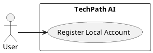
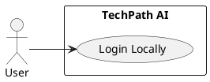
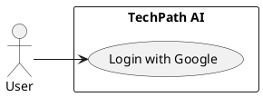
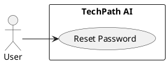
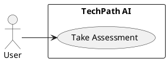
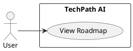
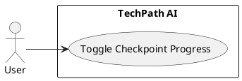
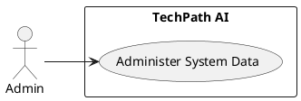

# SOFTWARE REQUIREMENTS SPECIFICATION (SRS)
**Project Name:** TechPath AI – IT Career Compass
**Context:** Intelligent Career Guidance System
**Version:** 1.1 (Detailed Specification following template)
**Group / Owner:** 08 (Replace if needed)

---

## TABLE OF CONTENTS

1. [INTRODUCTION](#1-introduction)
    1.1 [Purpose](#11-purpose)
    1.2 [Scope](#12-scope)
    1.3 [Overview](#13-overview)
    1.4 [Definitions, Acronyms, and Abbreviations](#14-definitions-acronyms-and-abbreviations)
    1.5 [References](#15-references)
2. [GENERAL DESCRIPTION](#2-general-description)
    2.1 [Product Perspective](#21-product-perspective)
    2.2 [Product Functions](#22-product-functions)
    2.3 [User Characteristics](#23-user-characteristics)
    2.4 [General Constraints](#24-general-constraints)
    2.5 [Assumptions and Dependencies](#25-assumptions-and-dependencies)
3. [REQUIREMENTS](#3-requirements)
    3.1 [External Interface Requirements](#31-external-interface-requirements)
        3.1.1 [User Interfaces](#311-user-interfaces)
        3.1.2 [Hardware Interfaces](#312-hardware-interfaces)
        3.1.3 [Software Interfaces](#313-software-interfaces)
        3.1.4 [Communications Interfaces](#314-communications-interfaces)
    3.2 [Functional Requirements](#32-functional-requirements)
        3.2.0 [Use Cases Overview](#320-use-cases-overview)
        3.2.1 [User](#321-user)
        3.2.2 [Admin](#322-admin)
    3.3 [Performance Requirements](#33-performance-requirements)
    3.4 [Design Constraints](#34-design-constraints)
    3.5 [Attributes (Non-Functional Requirements)](#35-attributes-non-functional-requirements)
    3.6 [Other Requirements](#36-other-requirements)
[APPENDICES](#appendices)

---

## 1. INTRODUCTION

### 1.1 Purpose
This Software Requirements Specification (SRS) provides a comprehensive, detailed blueprint for the **TechPath AI** system. The explicit purpose of this document is to explicitly outline and detail every functional feature, system interface, and non-functional constraint of the application based closely on the internal source code (`main.py`, `models.py`). This document is intended to serve as the ultimate baseline for system design, implementation grading, and final evaluation, providing a common understanding for the instructor and development team.

### 1.2 Scope
**TechPath AI** is an intelligent, full-stack career guidance platform tailored specifically to navigate the complexities of the IT industry. The system guarantees guidance for users by conducting an intuitive assessment and subsequently generating an interactive, customized learning roadmap.

**In-scope functionalities:**
- **Account Generation & Lifecycle:** Local credential Registration alongside Google OAuth 2.0 integrations, heavily secured by `bcrypt` hashing and OTP email workflows.
- **Dynamic Assessment Engine:** A multi-step asynchronous form evaluating explicit career path targeting vs. open-ended interest matching without reloading whole web pages.
- **Roadmap Dashboard & Progress Evaluation:** Directing unstructured AI insights into highly tracked local database entities (`Phases`, `Checkpoints`, `Resources`). The system captures user checkmarks to formulate numeric completion percentages dynamically.

**Out-of-scope:**
- Plagiarism detection and assignment grading.
- Live instructor-led mentoring or text-based instant messaging between peers.

### 1.3 Overview
This document consists of three main chapters. Section 1 outlines the general context. Section 2 describes the macroscopic environment, product perspectives, and core constraints where TechPath AI lives. Section 3 exhaustively details internal capabilities, grouping functional requirements directly under their actor roles (User, Admin), mapping strictly to system performance standards and exterior interfaces (Database/SMTP).

### 1.4 Definitions, Acronyms, and Abbreviations

| Term/Acronym | Definition |
| --- | --- |
| **HTMX** | High Power Tools for HTML. Empowers partial DOM replacements via AJAX natively from HTML tags, avoiding client-side state complexities. |
| **SQLModel** | A library leveraging Pydantic and SQLAlchemy designed to seamlessly bind python objects directly to SQL table definitions. |
| **Jinja2** | The templating engine utilized by FastAPI to construct and render dynamic data onto HTML documents before delivery. |
| **OTP** | One-Time Password. Used for securing forgotten account lifecycles. |
| **MIME** | Multipurpose Internet Mail Extensions, a standard that extends the format of email to support text/HTML and attachments. |

### 1.5 References
- Product Backlog and Source Repository (`main.py`, `database.py`).
- FastAPI documentation for ASGI frameworks.
- Google Identity Services APIs specification.

---

## 2. GENERAL DESCRIPTION

### 2.1 Product Perspective
TechPath AI functions as an entirely independent web-based Software as a Service (SaaS). It operates in a standard Client-Server architectural pattern. 
1. **The Client (Browser):** Parses and displays standard HTML5/CSS3. Interactivity is supplemented heavily with HTMX replacing traditional single-page application complexities.
2. **The Server Layer:** A Python FastAPI routing instance validating HTTP forms and session configurations.
3. **The Data Layer:** System records are governed strictly by a normalized, local SQLite database (`techpath.db`). 

### 2.2 Product Functions
- **Sign up / Sign in Operations:** Users seamlessly provision database user objects manually or authenticate through a third-party Google provider.
- **Restoring Access Operations:** User requests an OTP via email, enters the OTP into an HTMX-rendered view, and secures a new password token.
- **Executing Assessments:** Users provide current capability metrics (Weekly hours, Skills). The backend intercepts these answers to construct parameters.
- **Roadmap Visualization:** Detailed rendering of learning paths mapping phases and resource links directly within a unified tracking hierarchy.
- **Milestone Management:** Toggle checkpoints dynamically and visualize the global roadmap completion math directly without screen flashes.

### 2.3 User Characteristics
The system targets diverse individuals needing structured IT learning paths:
- **“The Confused Fresher”:** A university student overwhelmed by IT definitions. Requires the system's "Not yet known" capability to measure general traits across 10 areas (like Interest in abstract math vs. UI prototyping).
- **“The Focused Transitioner”:** An existing professional focusing precisely on "Artificial Intelligence (AI) Engineer". Needs direct parsing of specific competency layers (e.g., Python math basics) without generic testing.

### 2.4 General Constraints
- **Asynchronous Execution Constraint:** Generative AI logic dictates heavy waiting periods; therefore, backend algorithms (`async def`) must avoid blocking thread limits to allow multiple clients concurrent dashboard access.
- **Database Modularity constraint:** The system strictly utilizes relational SQLite syntax, converting unmappable parameters into JSON-serialized strings inside individual column cells.

### 2.5 Assumptions and Dependencies
- The system unconditionally assumes the availability of an SMTP relay (`smtp.gmail.com` initialized over SSL Port 465) properly configured with application-specific passwords.
- Google Client IDs strictly match authorized redirect origins established within the Google Cloud Console. Failure restricts integration signups.

---

## 3. REQUIREMENTS

### 3.1 External Interface Requirements

#### 3.1.1 User Interfaces
- The web app heavily utilizes a responsive, academic aesthetic based on modern navy-blue (`#0d3b66`) and gold elements (`#f5c842`). 
- **Account Forms:** Utilize Bootstrap floating inputs. Form errors invoke alert banners rendered conditionally above submissions.
- **Roadmap Board:** Uses an intuitive vertical timeline. Phases collapse gracefully (Bootstrap Accordions), containing bulleted interactive HTML checkpoints mapped carefully to backend logic.

#### 3.1.2 Hardware Interfaces
- The application executes on servers fulfilling minimum memory requirements necessary to persist SQLite `.db` read/write blocks. Client devices strictly require modern browsers capable of establishing continuous HTTP traffic pipelines without unique hardware requirements.

#### 3.1.3 Software Interfaces
- **Local Relational Boundaries:** Connects continuously to SQLite storing exact entity models ensuring structural consistencies. `User` retains configuration elements (`hours_per_week`, `primary_skills`). `Assessment` stores serialized strings. `Roadmap` hosts dynamic math outputs connected structurally to multiple `Phase` and `Checkpoint` definitions tracking the booleans (`is_complete`).
- **OAuth Providers:** Interfaces externally to `https://accounts.google.com` receiving verified payload configurations capturing explicit user context via Bearer tokens.

#### 3.1.4 Communications Interfaces
- Uses standardized HTTP protocol via TCP/IP routing boundaries. 
- Customly replaces strict JSON API consumption through pure HTML HTMX injections where asynchronous component modification is optimal.

---

### 3.2 Functional Requirements

#### 3.2.0 Use Cases Details

Dưới đây là chi tiết từng Use Case. Mỗi Use Case sẽ có **Code PlantUML** và **Bảng Specification** đi kèm.

**UC-1: Register Local Account**

*Code PlantUML:*

*Bảng Specification:*
| | |
|---|---|
| **ID & Name:** | UC-1: Register Local Account |
| **Primary Actor:** | User |
| **Description:** | User creates a new local account using email and password. |
| **Trigger:** | User clicks on "Sign Up" button. |
| **Pre-conditions:** | User is not logged in. |
| **Post-conditions:** | System generates a new user account with hashed password. |
| **Normal Flow:** | 1. Input Name, Email, Password 2. Click submit 3. System hashes password and saves User to database |
| **Alternative Flows:** | None |
| **Exceptions:** | **Exception #1:** Email is already registered 2. Click submit 3. System displays "Email already exists" |
| **Priority:** | High |

---

**UC-2: Login Locally**

*Code PlantUML:*

*Bảng Specification:*
| | |
|---|---|
| **ID & Name:** | UC-2: Login Locally |
| **Primary Actor:** | User |
| **Description:** | User logs into the system using their registered email and password. |
| **Trigger:** | User clicks on "Login" button. |
| **Pre-conditions:** | User must have an existing local account. |
| **Post-conditions:** | User session token is assigned and user is navigated to dashboard. |
| **Normal Flow:** | 1. Input Email, Password 2. Click login 3. System verifies credentials 4. System issues session token and redirects to Dashboard |
| **Alternative Flows:** | None |
| **Exceptions:** | **Exception #1:** Invalid credentials 2. Click submit 3. System displays "Invalid username or password" |
| **Priority:** | High |

---

**UC-3: Login with Google**

*Code PlantUML:*

*Bảng Specification:*
| | |
|---|---|
| **ID & Name:** | UC-3: Login with Google |
| **Primary Actor:** | User |
| **Description:** | User is authenticated securely via Google Identity Services. |
| **Trigger:** | User clicks "Sign in with Google". |
| **Pre-conditions:** | User has a valid Google account. |
| **Post-conditions:** | User successfully logs in; an account is dynamically created if new. |
| **Normal Flow:** | 1. Click Google OAuth button 2. Google authenticates the user 3. System captures and verifies identity payload 4. System establishes session and redirects |
| **Alternative Flows:** | 3.1. Email is not recognized in system 3.2. System registers a new User seamlessly 3.3. Proceed to establish session |
| **Exceptions:** | **Exception #1:** Google authentication fails or cancels 2. API fails 3. System displays error banner |
| **Priority:** | High |

---

**UC-4: Reset Password**

*Code PlantUML:*

*Bảng Specification:*
| | |
|---|---|
| **ID & Name:** | UC-4: Reset Password |
| **Primary Actor:** | User |
| **Description:** | User restores access via an OTP email validation workflow. |
| **Trigger:** | User clicks the "Forgot Password" link. |
| **Pre-conditions:** | User is unable to log in and needs to reset their password. |
| **Post-conditions:** | User successfully sets a new secure password. |
| **Normal Flow:** | 1. Input registered email 2. Click "Get OTP" 3. System emails an OTP with a 5-minute lifespan 4. Input OTP and new password in HTMX view 5. Click submit 6. System hashes and stores new password |
| **Alternative Flows:** | None |
| **Exceptions:** | **Exception #1:** OTP expired 4. Input expired OTP 5. System rejects and displays "Timeout limits reached" **Exception #2:** Code mismatch 4. Input invalid OTP 5. System displays error message |
| **Priority:** | High |

---

**UC-5: Take Assessment**

*Code PlantUML:*

*Bảng Specification:*
| | |
|---|---|
| **ID & Name:** | UC-5: Take Assessment |
| **Primary Actor:** | User |
| **Description:** | User completes the assessment survey to measure logical and technical capacities. |
| **Trigger:** | User clicks "Start Assessment". |
| **Pre-conditions:** | User is logged in. |
| **Post-conditions:** | System generates user aptitude configuration. |
| **Normal Flow:** | 1. Select basic preferences (hours/week) in Step 1 2. System dynamically loads sequential HTML queries via HTMX 3. User answers remaining queries and clicks submit 4. Variables evaluated behind API to calculate traits |
| **Alternative Flows:** | 2.1. User selects "Software Engineer" target path 2.2. Subsequent questions query directly on technical skills 2.3. Return to normal flow step 3 |
| **Exceptions:** | None |
| **Priority:** | High |

---

**UC-6: View Roadmap**

*Code PlantUML:*

*Bảng Specification:*
| | |
|---|---|
| **ID & Name:** | UC-6: View Roadmap |
| **Primary Actor:** | User |
| **Description:** | User views their customized learning roadmap phase-by-phase. |
| **Trigger:** | User navigates to Roadmap Dashboard. |
| **Pre-conditions:** | User has completed the assessment and a roadmap is generated. |
| **Post-conditions:** | System presents an interactive chronological timeline UI. |
| **Normal Flow:** | 1. Dashboard queries Roadmap entity 2. System iterates Phases and Checkpoints 3. Page renders collapsing HTML elements (accordions) 4. User expands individual Phases to view Checkpoints |
| **Alternative Flows:** | None |
| **Exceptions:** | **Exception #1:** No roadmap found 1. Dashboard queries Roadmap 2. System redirects user, asking to take Assessment first |
| **Priority:** | High |

---

**UC-7: Toggle Checkpoint Progress**

*Code PlantUML:*

*Bảng Specification:*
| | |
|---|---|
| **ID & Name:** | UC-7: Toggle Checkpoint Progress |
| **Primary Actor:** | User |
| **Description:** | User marks an individual learning checkpoint as done/undone, recalculating completion percentage. |
| **Trigger:** | User toggles `is_complete` checkbox for a milestone. |
| **Pre-conditions:** | User has an active Roadmap phase displayed. |
| **Post-conditions:** | System persists the state toggle to the database and recalculates global Roadmap completeness. |
| **Normal Flow:** | 1. Click single Checkpoint toggle 2. System executes an asynchronous HTMX server call 3. System transacts the inverted `is_complete` boolean 4. System mathematically recalculates completion percent and updates UI |
| **Alternative Flows:** | None |
| **Exceptions:** | **Exception #1:** Network disconnect 2. Backend API fails to map request 3. Partial view reset reverts Checkpoint state visually |
| **Priority:** | High |

---

**UC-8: Administer System Data**

*Code PlantUML:*

*Bảng Specification:*
| | |
|---|---|
| **ID & Name:** | UC-8: Administer System Data |
| **Primary Actor:** | Admin |
| **Description:** | Admin inserts seed records directly through backend routines bypassing web interface. |
| **Trigger:** | Admin triggers executing scripts in a CLI shell. |
| **Pre-conditions:** | Admin has direct backend CLI access. |
| **Post-conditions:** | Main database SQLite definitions acquire initial properties (mock values). |
| **Normal Flow:** | 1. Invoke `python seed.py` 2. Data structures interact directly, internally formatting parameters 3. Command executes population logic 4. System outputs success status via standard output |
| **Alternative Flows:** | None |
| **Exceptions:** | **Exception #1:** Integrity violations 3. System raises traceback displaying relational key failure |
| **Priority:** | Medium |

#### 3.2.1 User

**3.2.1.1 Identity Validation & Access Logic**
- **FR01:** The system shall create an identity providing Name, Email, Password. Passwords unconditionally pass through `pwd_context.hash` evaluating `bcrypt` security measures before storage.
- **FR02:** The system shall parse Google Identity Services credentials using `id_token.verify_oauth2_token`. Unrecognized emails trigger silent account creations assigning standard `User` entities organically.
- **FR03:** The system must restrict private dashboards exclusively to users demonstrating existence of `session_token` browser cookies.

**3.2.1.2 The Secure Access Restoration Pipeline**
- **FR04:** Users triggering the "/forgot-password" endpoint initiate the allocation of a 6-digit cryptographical code. This code maps alongside an absolute timestamp restricting lifespan directly to exactly 5 minutes (`timedelta(minutes=5)`).
- **FR05:** A `MIMEMultipart` HTML-rendered email explicitly containing the active token dispatches globally passing through a `smtplib.SMTP_SSL` conduit.
- **FR06:** The "/verify-otp" mechanism evaluates both code accuracy and timestamp mortality. Any failure aborts session recovery without side effects.

**3.2.1.3 Formulating The Assessment Sequence**
- **FR07:** HTMX mechanisms step-by-step fetch partial HTML segments `/assessment/step`. Step 1 logs categorical boundaries.
- **FR08:** Selecting targeted careers ("Software Engineer") prompts the algorithm to query technical proficiencies uniquely related to standard job skills. Selecting "Undecided" shifts the algorithm towards 1-5 scalar validations testing psychological alignments versus broad mathematical strengths.
- **FR09:** String formats specifying duration strings (e.g., "10-15 hours") invoke standard RegEx parsing functions extracting integers automatically mapped into User configurations.

**3.2.1.4 Tracking The Dynamic Learning Lifecycle**
- **FR10:** Backends consolidate assessment surveys triggering generation. AI algorithms build tree-structures resulting internally mapped as Database nested trees: (`Roadmap` -> `Phase` -> `Checkpoint`).
- **FR11:** Toggling individual HTML checkboxes instantly executes `POST /api/checkpoint/{id}/toggle` commands directly converting backend database statuses.
- **FR12:** Activating a milestone commands the math protocol retrieving full lengths of Checkpoints mapping against complete subsets. Values multiply scaling correctly updating overall roadmaps seamlessly out of 100%.

#### 3.2.2 Admin

**3.2.2.1 Administrative Initializations**
- **FR13:** Administrators handle complex table wiping or initial mock entity seeding exclusively running external CLI operations mapping explicitly logic functions mapped natively through scripts (e.g., `seed.py`).

---

### 3.3 Performance Requirements

| ID | Requirement | Target | Verification |
|---|---|---|---|
| PERF-01 | UI page load for base interfaces (Login, Dashboard, Home) | < 1.5 seconds locally | Browser performance test on local environment. |
| PERF-02 | Initial AI-generated Roadmap load and evaluation | < 15.0 seconds locally | Network profiling of generative API latencies. |
| PERF-03 | Background processing response for localized HTMX assessment elements | < 300 ms | Manual test + network profiling. |
| PERF-04 | Secure email dispatch pipeline execution (OTP delivery) | < 4.0 seconds timeframe | Test: verify wait times; manual verification of delivery. |
| PERF-05 | Checkpoint status computations and database persistence | < 250 ms round-trip window | Demo benchmark: toggle checkpoint and record round-trip time. |

### 3.4 Design Constraints
- All processes execute inside strict ASGI boundaries (`Uvicorn` servers) utilizing Python's `async/await` syntax ensuring scalable capabilities natively.
- UI manipulation enforces Server-Side Rendering behaviors manipulating DOM trees via HTML over the wire instead of pure Single-Page variations ensuring smaller client-download thresholds.

### 3.5 Attributes (Non-Functional Requirements)

Each NFR includes a rationale (why we implement it) and maps to relevant system behaviors.

| REQ# | PRIORITY | DESCRIPTION | RATIONALE | USE CASE |
|---|---|---|---|---|
| NFR-001 | Critical | **Security:** Passwords must be non-reversibly encrypted (e.g., `bcrypt`). Session IDs and user paths must aggressively map using GUID structures (`uuid4`) rejecting linear enumeration. | To reduce the risk of account compromise and prevent potential hijackers from iterating through active server sessions. | UC-1: Register, UC-2: Login |
| NFR-002 | High | **Reliability:** Internal server time measurements must directly standardize to local Vietnam Time (`get_vietnam_time`) rather than relying on default system global clocks. | To prevent obscure expiration discrepancies and ensure time-sensitive operations (like 5-minute OTP lifespans) behave reliably. | UC-4: Reset Password |

### 3.6 Other Requirements
#### 3.6.1 Operations
- Deployment commands and debugging protocols consistently depend intrinsically upon simple startup executables natively mapping module applications `uvicorn main:app --reload`.

#### 3.6.2 Site Adaptation
- User interface must continuously conform mathematically against Bootstrap viewport width changes scaling text components perfectly matching mobile constraints.

---

### APPENDICES

**APPENDIX A: Sample Input/Output Formats**
The assessment wizard submits large sets of integer ratings (e.g., variables explicitly mapped as `interest_0` -> `interest_x`), alongside general string properties formatting final JSON outputs serialized manually (`raw_survey`).

**APPENDIX B: API Handshake Pack**
Internal endpoints are tightly scoped logic boundaries maintaining standard form encodings (`application/x-www-form-urlencoded`). Responses commonly redirect using `303` configurations instead of strict `200` statuses natively mapping standard Web UX pipelines.

**APPENDIX C: Error Schema**
No externalized third-party API JSON consumptions currently utilize schema maps. Native frontend feedback strictly encapsulates HTML injection elements containing bootstrap warning descriptors (e.g., "Mật khẩu không khớp").

**APPENDIX D: Traceability Matrix**
Code features trace flawlessly against functional requirements defined herein: OTP generation -> FR04, Progress Checkpoints Toggle -> FR11/FR12, `bcrypt` -> FR01.

**APPENDIX E: Requirements Ownership**
Handled uniformly by Group 08 enforcing integrated reviews across the database modelings combined seamlessly spanning UX elements.

**APPENDIX F: Course Topic Coverage**
Project satisfies intensive web engineering models encapsulating secure databases, modern routing, Object-relational mapping capabilities, responsive web designing methods, and cryptographic validation protocols simultaneously providing dynamic user utilities natively.

---
*END OF DOCUMENT./.*
